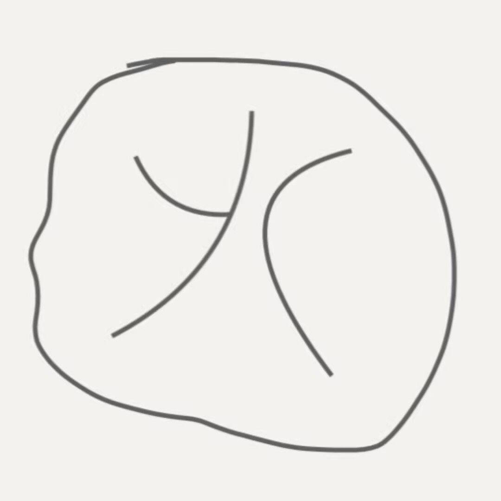
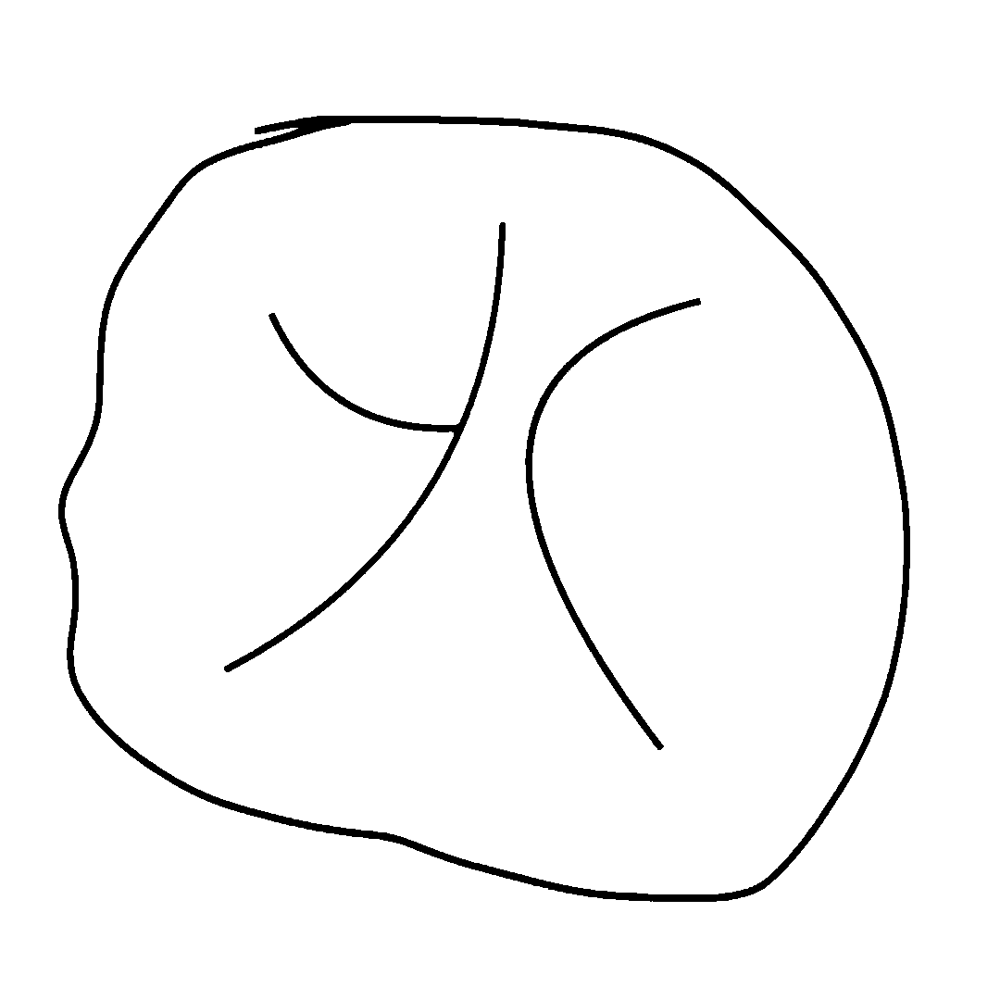
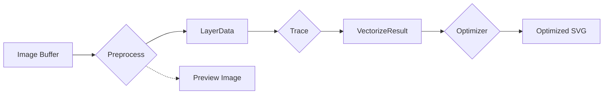

# cv-trace

A library for tracing images to SVG

[](https://badge.fury.io/js/cv-trace)
[](https://www.gnu.org/licenses/old-licenses/gpl-2.0.en.html)

## Install

```bash
npm install cv-trace
# or
pnpm add cv-trace
```

## Start quickly

```javascript
import { readFileSync, writeFileSync } from "fs";
import { binaryPreprocess, potrace, svgoOptimize } from "cv-trace";
import type { BinaryOptions } from "cv-trace";
// 1. Binary preprocessing
const layerData = await binaryPreprocess(imageBuffer, {
  threshold: [128, 255],
  color: "#000000",
} as BinaryOptions);
// 2. Vectorize with potrace
const result = await potrace(layerData);
// 3. Optimize SVG (optional)
result.svg = await svgoOptimize(result.svg);
writeFileSync("./output.svg", result.svg);
writeFileSync("./preview.png", result.preprocessedImage);
```

```javascript
import { readFileSync, writeFileSync } from "fs";
import { quantizePreprocess, potrace, svgoOptimize } from "cv-trace";
import type { QuantizeOptions } from "cv-trace";
const imageBuffer = readFileSync("./test1.jpg");
// 1. Color quantization preprocessing  
const layerData = await quantizePreprocess(imageBuffer, {
  colorCount: 16,
  minPercent: 0,
  stack: true,
} as QuantizeOptions);
// 2. Vectorize with potrace
const result = await potrace(layerData);
// 3. Optimize SVG (optional)
result.svg = await svgoOptimize(result.svg);
writeFileSync("./output1.svg", result.svg);
writeFileSync("./preview1.png", result.preprocessedImage);
```

> CommonJS : `const { binaryPreprocess, potrace, optimizeSvg } = require("cv-trace");`

### Example

|        Original Image        |         Preprocessed Image         |          Vector Result           |
| :--------------------------: | :--------------------------------: | :------------------------------: |
|  |  |  |
|    |    |    |
|  |  |  |

## Core

### Type

```ts
export type Layer = {
  id: string;
  zIndex: number;
  color: string;
  imageBuffer: Buffer;
}

export type OriginalMetadata = {
  width: number;
  height: number;
  format?: string;
}

export type LayerData = {
  layers: Layer[];
  preprocessedImage: Buffer;
  originalMetadata: OriginalMetadata;
}

export type VectorizeResult = {
  svg: string;
  preprocessedImage: Buffer;
  originalMetadata: OriginalMetadata;
}
```

### Process Flow

(Image Buffer) --preprocess--> (LayerData) --trace--> (VectorizeResult) --
optimizer--> (VectorizeResult)



## Preprocess

Use Preprocessor to convert Image Buffer to LayerData ( with preprocessedImage for Preview )

### Preprocessor

Convert the original image to layers of black and white binary image masks (Buffer), and carry layer and color information (although non-binary images are also supported, it is recommended to convert to binary images, because this provides better control)

> Plan to support more Preprocessor in the future. And quantization according to color will be preferred (Actually, color quantization has been implemented, but we are thinking about how to make the code more elegant)

## Trace

### Tracer

Currently uses potrace to convert LayerData to a hierarchical SVG image

> Plan to support more tracers in the future

## Optimizer

> Plan to use svgo to optimize svg string

## Credits

- [Potrace](http://potrace.sourceforge.net/)
- [inkscape](https://inkscape.org/)
- [image-quantization](https://github.com/ibezkrovnyi/image-quantization)
- [svgo](https://github.com/svg/svgo)
- [jimp](https://github.com/jimp-dev/jimp)

## LICENSE

[GPL-2.0-or-later](LICENSE)

> Potrace is GPL LICENSE
