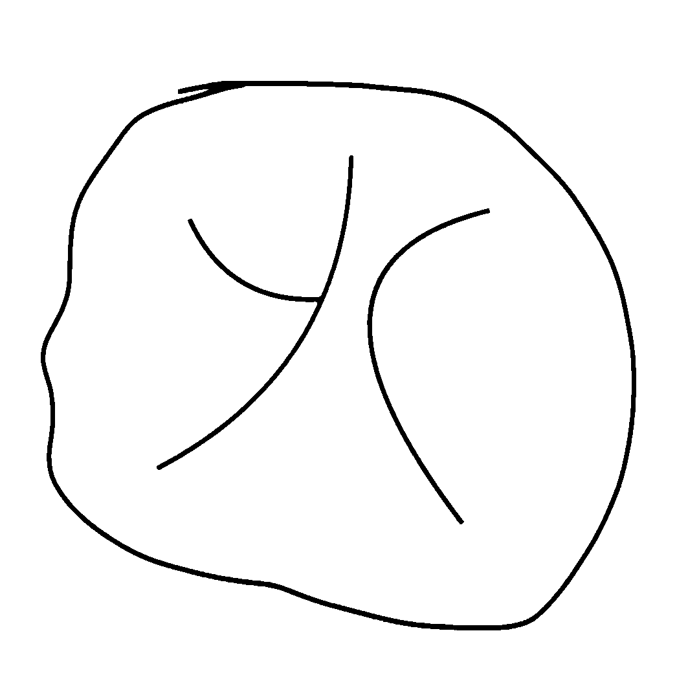

# cv-trace

A library for tracing images to SVG

[](https://badge.fury.io/js/cv-trace)
[](https://www.gnu.org/licenses/old-licenses/gpl-2.0.en.html)

## Install

```bash
npm install cv-trace
# or
pnpm add cv-trace
```

## Start quickly

```typescript
import { readFileSync, writeFileSync } from "fs";
import { BinaryPreprocess, Potrace, OptimizeSvg } from "cv-trace";

////////// test 1 : Binary //////////

const imageBuffer = readFileSync("./test.jpg");

// 1. Preprocess (if use BinaryPreprocess)
const layerData = await BinaryPreprocess(imageBuffer, {
  threshold: [128, 255],
  color: "#000000",
});

// 2. Trace (if use Potrace)
const result = await Potrace(layerData);
// 3. Optimize (optional)
result.svg = await OptimizeSvg(result.svg);

writeFileSync("./output.svg", result.svg);
writeFileSync("./preview.png", result.preprocessedImage);
```

```typescript
import { readFileSync, writeFileSync } from "fs";
import { QuantizePreprocess, Potrace, OptimizeSvg } from "cv-trace";

////////// test 2 : Color //////////

const imageBuffer1 = readFileSync("./test1.jpg");

// 1. Preprocess (if use QuantizePreprocess)
const layerData1 = await QuantizePreprocess(imageBuffer1, {
  colorCount: 16,
  minPercent: 0,
  stack: true,
});

// 2. Trace (if use Potrace)
const result1 = await Potrace(layerData1);
// 3. Optimize (optional)
result1.svg = await OptimizeSvg(result1.svg);

writeFileSync("./output1.svg", result1.svg);
writeFileSync("./preview1.png", result1.preprocessedImage);
```

test.jpg -> preview.png -> output.svg

### Example

| Original Image | Preprocessed Image | Vector Result |
|:--------------:|:-----------------:|:-------------:|
|  |  |  |
|  |  |  |
| test.jpg | preview.png | output.svg |

## Core

### Type

```ts
export interface Layer {
  id: string;
  zIndex: number;
  color: string;
  imageBuffer: Buffer;
}

export interface OriginalMetadata {
  width: number;
  height: number;
  format?: string;
}

export interface LayerData {
  layers: Layer[];
  preprocessedImage: Buffer;
  originalMetadata: OriginalMetadata;
}

export interface VectorizeResult {
  svg: string;
  preprocessedImage: Buffer;
  originalMetadata: OriginalMetadata;
}
```

### Process

(Image Buffer) --preprocess--> (LayerData) --trace--> (VectorizeResult) --optimizer--> (VectorizeResult)

## Preprocess

Use Preprocessor to convert Image Buffer to LayerData ( with preprocessedImage for Preview )

### Preprocessor

Convert the original image to layers of black and white binary image masks (Buffer), and carry layer and color information (although non-binary images are also supported, it is recommended to convert to binary images, because this provides better control)

> Plan to support more Preprocessor in the future. And quantization according to color will be preferred (Actually, color quantization has been implemented, but we are thinking about how to make the code more elegant)

## Trace

### Tracer

Currently uses potrace to convert LayerData to a hierarchical SVG image

> Plan to support more tracers in the future

## Optimizer

> Plan to use svgo to optimize svg string

## LICENSE

[GPL-2.0-or-later](LICENSE)

> Potrace is GPL LICENSE
