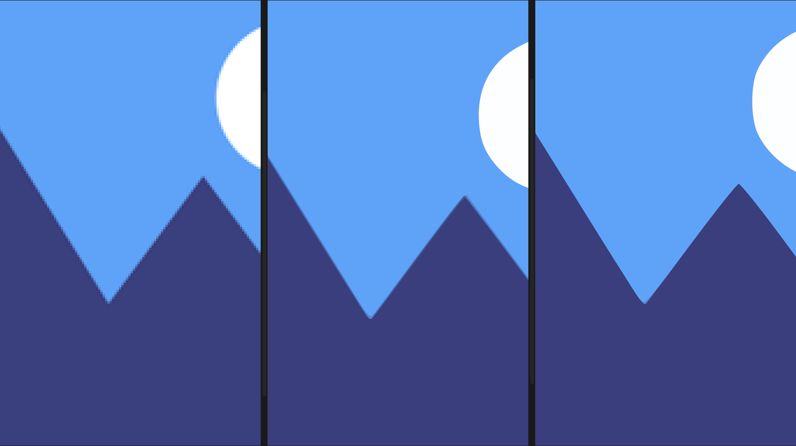
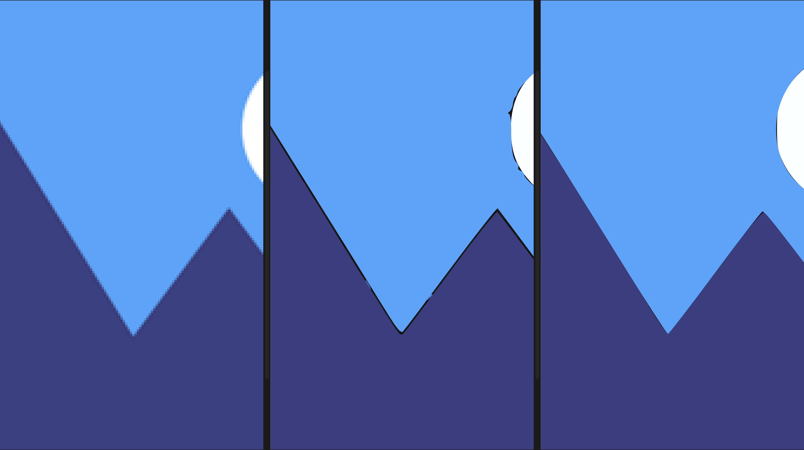

# Preprocessor API Documentation

Preprocessors convert input images into multi-layer binary mask data (`LayerData`) for subsequent vectorization processing.

## Binary Preprocessor

### API

```typescript
export async function binaryPreprocess(
  image: Buffer,
  options: BinaryOptions = {}
): Promise<LayerData>;
```

### Parameters

- `threshold?: [number, number]` - Threshold range (default: [128, 255])
- `color?: string` - Output color (default: "#000000")

## Quantize Preprocessor

### API

```typescript
export async function quantizePreprocess(
  image: Buffer,
  options: QuantizeOptions = {}
): Promise<LayerData>;
```

### Parameters

- `colorCount?: number` - Number of colors (default: 8)
- `minPercent?: number` - Minimum pixel percentage (default: 0)
- `stack?: boolean` - Stack mode (default: true)

## Quantize Pro Preprocessor

### API

```typescript
export async function quantizeProPreprocess(
  image: Buffer,
  options: QuantizeProOptions = {}
): Promise<LayerData>;
```

### Parameters

- `colorCount?: number` - Number of colors (default: 8)
- `minPercent?: number` - Minimum pixel percentage (default: 0)
- `stack?: boolean` - Stack mode (default: true)
- `median?: number` - Median filter size (optional)

### Example

#### Stack


> left: original picture; middle: quantizePreprocess; right: quantizeProPreprocess

#### Splice


> left: original picture; middle: quantizePreprocess; right: quantizeProPreprocess
